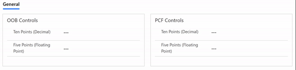

# D365 PCF - Truncated Number Control

[](https://github.com/cathalnoonan/d365-pcf-truncatednumber/actions/workflows/build.yml)
[]()

Displays the value of a number field truncated to remove trailing zeros



## Installation
Download the solution from the [Releases page](https://github.com/cathalnoonan/d365-pcf-truncatednumber/releases).

The recommended approach would be to install the managed solution as the controls are not editable from within D365

If the control must be added to another solution that will be deployed to other environments, then installing the un-managed solution will be a better option


## Building the component
If you wish to build the control yourself, follow the steps below

#### Prerequisites
- dotnet 8.0 is installed
- NPM is installed (this is bundled with Nodejs)
- Access to the internet to download packages from NPM

#### Steps
1. Clone this repository
2. Open a command prompt or terminal in the root directory of the repo
3. Run the build script:
  - ```bash
    dotnet build
    ```
4. Copy the built solution from the `dist` folder
